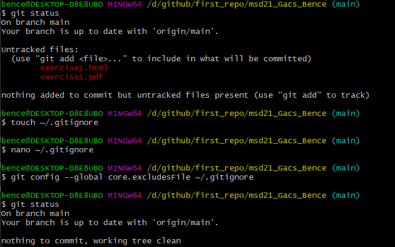

# git befehle

git config = beliebig oft zum aufrufen, get & set repo oder global options, query/set/replace/unset 

git init = pro repo wird’s 1x verwendet,  initializing directory as git repository

git commit = kann öfter aufgerufen werden, Status des Projektes wird abgerufen

git status = kann beliebig aufgerufen werden, zeigt Status vom „working tree“

git add = zum öfter aufrufen, vor jedem commit zum auswählen der datei weilche „commited“ 
werden soll ; <filename/directory> wird als parameter übergeben

git log = beliebig aufrufbar, utility tool zum nachschlagen der geschichte des repos, verschiedene parameter für spezifizischere Infos

git diff = kann auch öfter aufgerufen werden,zeigt Unterschiede zwischen commits, wokring tree usw, parameter müssen ü+bergeben werden

git pull = wird verwendet um Inhalte von einem remote-repo runterlädt und merged, parameter erforderlich

git push = inhalte von lokalem repo wird in ein virtuelles hochgeladen (Gegenstück zu pull), braucht auch parameter 

# Gitignore:
Nachm git config der ignore file, werden bei git status die pdf & html dateien nicht mehr als nicht hochgeladene dateien angezeigt und der baum ist sauber.

